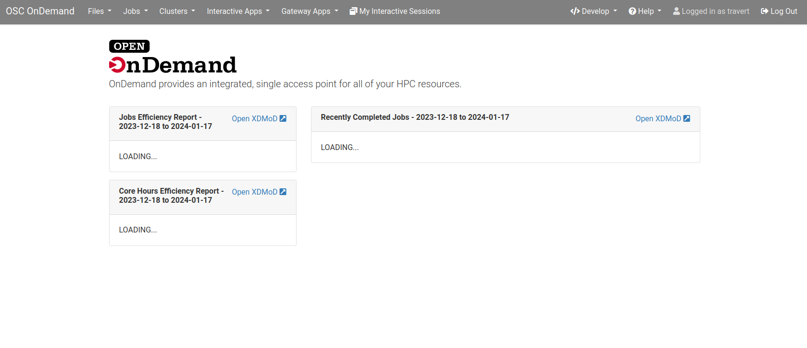
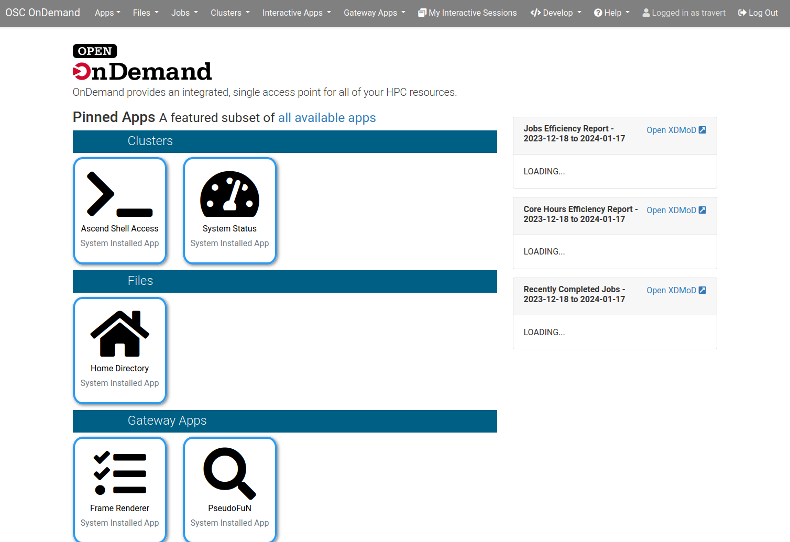

.. _app-development-tutorials-dashboard-apps-dashboard:

Developing the OOD Dashboard App
================================

.. warning::
    You muse have followed :ref:`enabling-development-mode` for any part of this tutorial to work.

Strategy
--------

#. Start by completing the :ref:`enabling-development-mode` steps.
#. Create a symlink named ``dev`` in the ``~/ondemand/misc/ondemand/<app>``. 
#. In the app's symlinked directory, use ``git branch`` to start your development work.
#. Create a ``.env.local`` file in the development dashboard app root to customize environment variables.
#. Rebuild the ``dashboard`` app using ``bin/setup`` out of the app's root for configuration changes.
#. Use the Sandbox to launch and iterate on your work.

Create a Dev Dashboard
----------------------
#. ``clone`` the OOD repo into: ``cd ~/ondemand/misc`` then ``git clone git@github.com:OSC/ondemand.git``
#. Work out of the ``dev`` directory/space: ``cd ~/ondemand/dev/``.
#. Symlink to the ``dashboard`` app in the cloned repo: ``ln -s ../misc/ondemand/apps/dashboard/dashboard/ dashboard``
#. Make a branch and to begin word on your dev dashboard: ``git checkout -b dev_work`` 
#. Rebuild the ood dashboard app:  ``bin/setup``.
#. Navigate to the Sandbox and launch your ``dashboard`` app to use the ``dev_work``.

Notice the ``url`` for this ``dev_dashboard`` app. No longer do 
you  see ``*/sys/dashboard/`` but instead ``*/dev/dashboard/``. 

Add ``.env.local`` File
-----------------------
Now that we have a our dev dashboard running, a good first step is to next ensure it 
looks different from the production dashboard. This will help ensure not ending up in the wrong tab, 
using ``sys/dashboard`` instead of ``dev/dashboard``, and possibly causing confusion.

Use an editor or IDE and do the following:

.. code-block:: sh

    cd ~/ondemand/dev/dashboard
    touch .env.local
    vim .env.local

The idea here is to make sure the dev dashboard *looks* different so we don't have to check that ``url`` in the 
browser to know which dashboard we are in.

Inside the ``.env.local`` we can add an environment variable to change the color of the dev dashboard like so:

.. code-block:: sh

    # .env.local file
    OOD_BRAND_BG_COLOR='grey'

Now click the ``Develop`` dropdown menu on the upper right corner and click ``Restart Web Server``. After a few moments 
you should now see the dashboard with a grey background in the banner. This will help to distinguish your dev 
environment from the production.

    Different banner color for the dev dashboard

Set Dev Configuration Directory
-------------------------------
Our dev dashboard is still using the same configuration files as the system dashboard, but we can change this.

Go back into ``.env.local`` and set a new path for *the dev dashboard to pick up its own 
configurations* using the ``OOD_CONFIG_D_DIRECTORY`` environment variable like so: 

.. code-block:: sh

    # .env.local file
    OOD_CONFIG_D_DIRECTORY="~/ondemand/dev/dashboard/config/ondemand.d/"

We need to *restart the PUN when we add or change environment variables* with ``bin/setup``. 

Add Dev Configurations
----------------------
Now, we can begin to set our own configurations in our new ``ondemand.d`` directory for 
the dev dashboard and see the changes. Let's add some configs to our dev dashboard to get 
an idea what can be done and play with the layout.

We will add ``pinned_apps`` to our dev dashboard as an example to see how this works.

Create a file in the ``~/ondemand/dev/dashboard/config/ondemand.d/`` directory named ``ondemand.yml`` then 
open the file and add the following:

.. code-block:: yaml
    
    pinned_apps:
      - sys/*
    pinned_apps_menu_length: 4
    pinned_apps_group_by: category

Assuming youre restarted the PUN when you set the new config directory above, you *should* be able to simply 
refresh the browser and see the new pinned apps layout take effect. If not though, simply restart the PUN 
as usual to force the changes.

    Dev dashboard with its own pinned apps configuration

Now, we can begin to add other configurations to this new ``ondemand.yml`` and keep restarting 
the PUN to see our changes.

This is a great way to test out new features, or play with any features you may be interested in with OOD before 
making the changes in production or spinning up a whole dev environment with a VM.

At this point you have all the pieces needed to use the :ref:`customizations` page and play with those changes 
in your dev dashboard.

But, what if we want to add something to Open OnDemand?

Develop OOD in OOD
------------------
With all the above in place, you can also begin to add features and functionality to OOD in this development 
setting to then see how this will actually run and work.

Suppose you see a feature being worked on in the OOD repo on the branch ``new_feature``. How could you pull 
this work down and see its current state while also trying to build it out?

First, launch the ``shell`` and go into your dev ``dashboard`` root then:

#. ``git pull``
#. ``git checkout new_feature``
#. ``bin/setup``

After the build you now have the feature ready to be worked right there in your dev dashboard.

Go ahead and enter you Sandbox and launch the dev dashboard. What you are in once that is done is the current 
state the feature is in. 

If you are not making any changes to the configurations, as the steps above mostly do, then each change to the code 
simply requires page refreshes to see the feature work.

